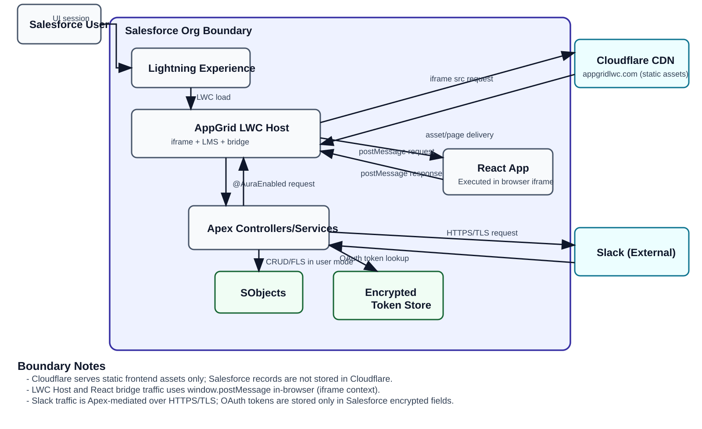

# AppGrid Architecture Diagram (Cloudflare + LWC + Slack)

## Boundary Notes

<ul>
<li>Cloudflare serves static frontend assets only; Salesforce customer records are not stored in Cloudflare.</li>
<li>Salesforce business logic and data access occur in LWC/Apex.</li>
<li>Bridge requests between LWC Host and React use <code>window.postMessage</code> within the browser iframe context.</li>
<li>Slack traffic is mediated by Apex HTTPS/TLS callouts and controlled by Salesforce auth/permission checks.</li>
<li>OAuth token material is stored only in Salesforce encrypted fields (Encrypted Token Store).</li>
</ul>

